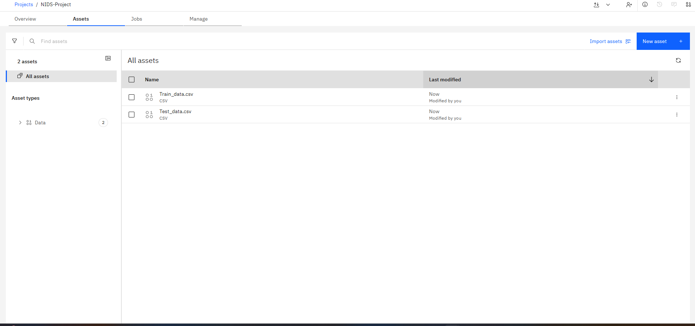

# 🧠 Network Intrusion Detection using Decision Tree Classifier

A machine learning model built using IBM Watsonx AutoAI to classify network traffic as benign or malicious.

---

## 🚀 Project Objective
To develop a Snap Decision Tree Classifier for Network Intrusion Detection using IBM Cloud tools only.

---

## 📂 Dataset
- *Training Dataset:* The training dataset consists of labeled network traffic records including both benign and malicious flows. Features include packet duration, source/destination bytes, packet size, flags, and protocol types. This dataset was used to train the Decision Tree Classifier using IBM AutoAI.

- *Testing Dataset:* A separate dataset containing similar types of network traffic was   used to evaluate the model. It was not involved in the training phase, ensuring an unbiased performance assessment.

---

## ⚙ AutoAI Setup

### Dataset Upload

### AutoAI Experiment
- Automatic preprocessing
- Model selection (Decision Tree)
- Pipeline leaderboard

---

## 📈 Model Evaluation
Model metrics as generated by AutoAI:

---

## 📊 Prediction Results

After training, the Decision Tree model was used to predict network traffic classes (benign or malicious) on the testing dataset.

### Sample Predictions
A few predicted outputs from the model on the test data:

- ✅ *Predicted Labels:* Shows whether each traffic record is classified as normal or attack.
- 📊 *Prediction Accuracy:* The model achieved high accuracy with balanced precision and recall.
- 🔍 *Insight:* Most attack types were accurately detected based on learned patterns.

---

## ✅ Conclusion
This project demonstrates the end-to-end use of IBM Watsonx AutoAI for creating a Network Intrusion Detection System.

---

## 📬 Contact
For questions, feel free to open an issue or contribute!
